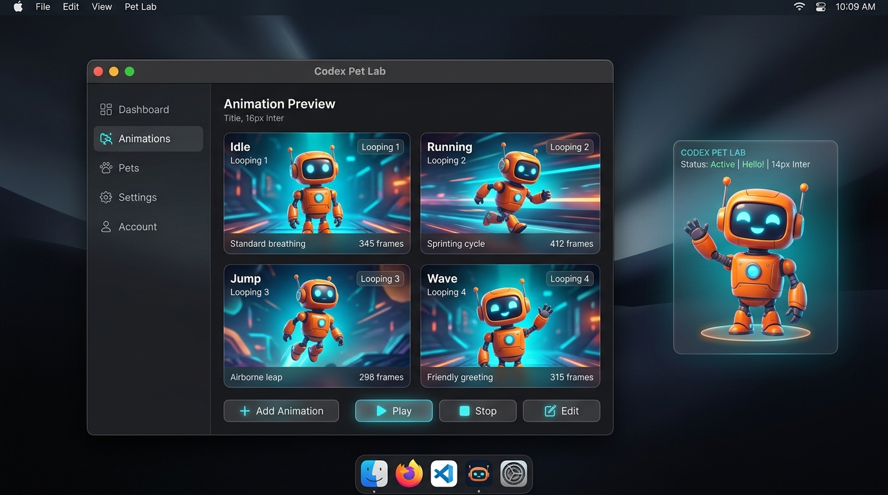

# Codex Pet WebP Demo (猫羽雫 · Shizuku Edition)

[中文](#中文) | [English](#english)

---

## 中文

这是一个基于 **Node.js + Electron** 的桌面悬浮宠物学习与开发演示项目。项目默认集成了开源桌面宠物 **猫羽雫 (Shizuku)** 的 WebP 动画精灵图，用于演示并实现以下关键机制：

* 🖼️ **静态 WebP 精灵图切帧**：使用单张 $1536 \times 2288$ 像素的 WebP 图像（$8 \times 11$ 帧网格），通过动态计算 CSS `background-position` 来实现流畅的帧动画播放。
* 🎮 **多状态动作控制**：内置支持待机 (Idle)、跑动 (Running)、挥手 (Waving)、跳跃 (Jumping) 等 9 种预设动画状态。
* 🖥️ **无边框透明置顶窗口**：在 Electron 中创建透明、无边框、不占用任务栏且始终在最前 (Always on Top) 的悬浮小组件。
* 🖱️ **智能鼠标穿透 (Click-Through)**：通过 Electron 的 `setIgnoreMouseEvents()` API 实现鼠标穿透。当指针悬浮在透明像素上时，操作可直接穿透；当触及宠物本体时，自动转换为可交互，从而支持点击与拖拽。
* 🎯 **物理坐标拖拽同步**：捕获 Pointer Events，通过 IPC 管道实时更新窗口位置 (`BrowserWindow.setPosition`)，并支持边缘阻尼限制，防止窗口飞出显示器。

### 项目预览



### 快速开始

#### 环境要求

* [Node.js](https://nodejs.org/) (推荐 v18 或更高版本)
* [Git](https://git-scm.com/)

#### 启动步骤

1. 克隆本项目：
   ```bash
   git clone https://github.com/connectedGraph/codex-pet-webp-demo.git
   cd codex-pet-webp-demo
   ```
2. 安装依赖：
   ```bash
   npm install
   ```
3. 运行程序：
   ```bash
   npm start
   ```

*Windows 用户也可以直接双击项目根目录下的 [start.ps1](file:///C:/Users/18086/Desktop/codex-pet-webp-demo/start.ps1) 脚本一键启动。*

### 控制面板功能

- **动画预览**：查看当前的 WebP 精灵图帧渲染状态。
- **暂停/继续**：点击预览区域或直接点击桌面宠物即可暂停/恢复动画。
- **动作切换**：点击右侧按钮模拟各种动作状态的切换。
- **查看完整雪碧图**：弹窗展示包含所有动作帧的原始 WebP 图像（支持滚轮缩放）。
- **重置位置**：将桌面宠物快速定位到主屏幕的右下角。

### 核心代码结构

* [main.js](file:///C:/Users/18086/Desktop/codex-pet-webp-demo/main.js)：主进程入口，管理生命周期、窗口创建、IPC 拖拽坐标计算与鼠标穿透设置。
* [preload.js](file:///C:/Users/18086/Desktop/codex-pet-webp-demo/preload.js)：桥接主进程与渲染进程的 API 网关。
* [sprite-player.js](file:///C:/Users/18086/Desktop/codex-pet-webp-demo/sprite-player.js)：通用的 WebP 精灵图序列帧播放引擎，定义了状态序列与延时帧间隔。
* [pet.js](file:///C:/Users/18086/Desktop/codex-pet-webp-demo/pet.js)：负责悬浮窗的拖拽监听、碰撞判定与穿透事件通信。
* `assets/codex-spritesheet.webp`：由项目作者开发的 **猫羽雫 (Shizuku)** 精灵图素材。

### 授权许可

- 代码采用 [MIT License](LICENSE) 开源。
- 精灵图素材 **猫羽雫 (Shizuku)** 遵循开源规范分发。

---

## English

A study and development demo for desktop floating pets based on **Node.js + Electron**. By default, this repository features the open-source pet **Shizuku (猫羽雫)** animations via WebP spritesheet, showcasing and implementing the following mechanisms:

* 🖼️ **Static WebP Sprite Splitting**: Uses a single $1536 \times 2288$ pixel WebP image ($8 \times 11$ frame grid), programmatically calculating CSS `background-position` to render fluid frame-by-frame animations.
* 🎮 **Multi-State Animation Control**: Built-in support for 9 preset animations including Idle, Running, Waving, Jumping, and more.
* 🖥️ **Borderless Transparent Floating Window**: Demonstrates how to create transparent, borderless, out-of-taskbar, and always-on-top overlay widgets in Electron.
* 🖱️ **Smart Mouse Click-Through**: Utilizes Electron's `setIgnoreMouseEvents()` API. Allows clicks to pass through transparent pixels while maintaining full interactivity (drag, click, hover) when the pointer sits on the pet's hitbox.
* 🎯 **IPC-driven Window Dragging**: Listens to HTML Pointer Events, calculating screen delta vectors and piping window move requests to `BrowserWindow.setPosition` with boundary bounds checking.

### Project Preview


### Quick Start

#### Requirements

* [Node.js](https://nodejs.org/) (v18+ recommended)
* [Git](https://git-scm.com/)

#### Running Locally

1. Clone this repository:
   ```bash
   git clone https://github.com/connectedGraph/codex-pet-webp-demo.git
   cd codex-pet-webp-demo
   ```
2. Install dependencies:
   ```bash
   npm install
   ```
3. Start the application:
   ```bash
   npm start
   ```

*Windows users can also double-click [start.ps1](file:///C:/Users/18086/Desktop/codex-pet-webp-demo/start.ps1) to launch the application instantly.*

### Control Panel Features

- **Animation Preview**: Visualizes how individual frames are extracted from the spritesheet.
- **Play/Pause**: Toggle playback by clicking on either the control panel preview stage or the floating pet itself.
- **State Simulation**: Simulate different animation loops with state buttons.
- **Atlas Viewer**: Displays the original WebP spritesheet in a modal with interactive zoom.
- **Reset Position**: Relocates the floating pet to the bottom-right corner of your primary display.

### Codebase Highlights

* [main.js](file:///C:/Users/18086/Desktop/codex-pet-webp-demo/main.js): Main process configuration, orchestrates window setups, coordinate validation, IPC actions, and click-through toggles.
* [preload.js](file:///C:/Users/18086/Desktop/codex-pet-webp-demo/preload.js): Context-isolated IPC bridge exposing safe `petAPI` to rendering contexts.
* [sprite-player.js](file:///C:/Users/18086/Desktop/codex-pet-webp-demo/sprite-player.js): Standard frame player configuring rows, columns, frame indices, and durations.
* [pet.js](file:///C:/Users/18086/Desktop/codex-pet-webp-demo/pet.js): Manages pointer drag actions, interactive hit testing, and state synchronization.
* `assets/codex-spritesheet.webp`: The WebP spritesheet of **Shizuku (猫羽雫)** created and open-sourced by the repository owner.

### License

- The codebase is licensed under the [MIT License](LICENSE).
- The Shizuku pet assets are distributed under open-source specifications.
